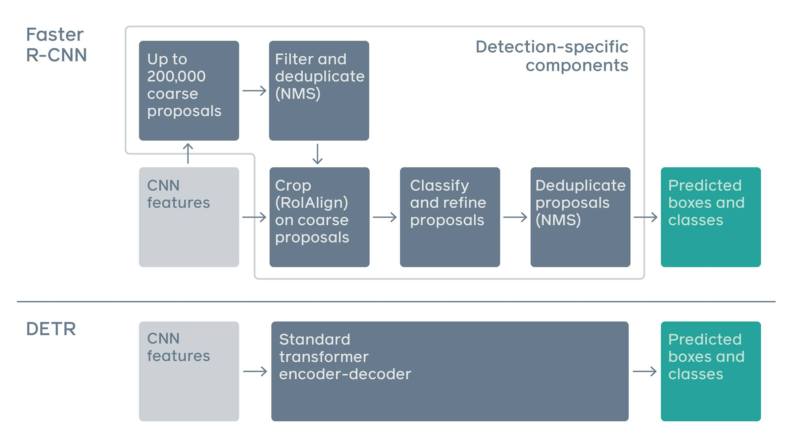

## DERT: Transformer

   * Always Start with a picture:
   * Input Image --> CNN --> Set of Image Features --> Transformer encoder-decoder -->
   {Set of box predictions} --> Bipartite matching loss

   * Adv:
       * In contrast to using FPN, RetinaNet
       or LSTM and detectors, we require less parameters --> DETR (simpler, more flexible pipeline architecture requires fewer heuristics)

       * []

       * In contrast to other methods like the RCNN Family and YOLO, SSD etc.. The above mentionned RPN (Region Proposal Network) woks with the concept of anchor boxes, NMX (non-max-suppression), and IOU to generate relevant boxes. RCNN inferencing is not achieved due to complexity in real time.

       * This method works: https://brilliant.org/wiki/hungarian-matching/
       * Bipartite Graph: https://www.youtube.com/watch?v=HqlUbSA9cEY
       * Bipartite Matching algorithm: Cubic Complexity
       * Transformers: https://towardsdatascience.com/transformers-89034557de14

## Reframing the task of object detection:

## Reference:
   * https://www.geeksforgeeks.org/object-detection-with-detection-transformer-dert-by-facebook/?ref=rp
