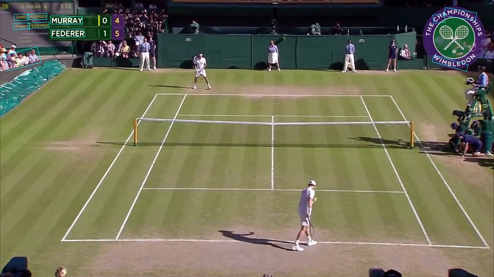
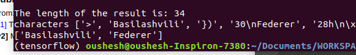

## Methodologies
   * Video Scene Classification
   * Scoreboard Extraction
   * ocr

## Optimisation and Inference:
  * Video Scene Classification: 
    The video sometimes contain commercials and highlights which
    need to be removed. classification as playing vs non-playing scene. (Binary Classification Problem). Several approaches will be mentionned below:
    * 1. Tennis Court Detection -- Classical Computer Vision.
          Hough Lines, Edge Detectors and Gaussian Smoothing.
          Elimination of Points via the Homography Matrix. (To find the tennis plane)
          
          

          Adv: Classical Computer Vision and can run in real time. 
          Disadv: Camera moves with the scene it can lead to fitting error. (plane rotation, etc..) --> Can be further solved by running a camera estimation
          parameter using Fundamental Matrix/Essential Matrix with Bundle Adjustment
          and warping the view.
    * 2.  I have viewed a bit of tennis videos, its pretty humanly clear to classify the   videos. Since the tennis court is a plane occupying most of the frame when focused on game rather than the commercial:
    We can use 3D Vectors or Feature Vectors: (example SIFT or Histogram of Oriented Gradients) learned. Use a banal classifier like SVM or even simple NN can classify
    the scenes. This could further be used to perform automatic annotation of data.

    * 3. Finally, one can use Deep Learning: Since the problem is more of a contrastive problem. Good Example vs Bad Example specifically. Siamese neural network
    would be a really good fit here.
    Disadv: its more work to manually build the positive pair vs negative pair for the anchor.
    Adv: * Really robust against noisy data. (Contrastive and Triplet Loss)
         * The feature extractor can be updated from VGG to ResNet to Inception NN if needed.

  * Scorecard Extraction
    * 1. Optical Flow + Detector  
    When one analyzes the video, one sees that the camera moves smoothly besides the commercials, whereas the scoreboard flashes in but mostly stays stable.  
    The idea thus is to use the Optical Flow to perform segmentation of the scoreboard.
    Find the vectors for which the optical flow is close to zero.   
    Adv: Super fast. Runs in realtime. (1987: Lukas Kanade). One requires to set
         the window/aperture size for the algorithm to function properly. Since
         the scoreboard in different videos are roughly the same (standardised),
         this is easily achieved.  

    Improvement:   
      use Cuda implementation.
      Nvidia Claim: https://developer.nvidia.com/opticalflow-sdk
      * Up to 150 fps at 4K resolution.
        * at 1/4 pixel resolution. (150/current_fps*4)x Improvement Factor.

        * Combine optical flow with detectors specifically trained for the scoreboard.
        * If we do not combine detectors with optical Flow tracker: we will performing
          inference on each incoming frame, which degrades time complexity.
          Time Complexity = Individual Complexity of the Detector*Number of Frames
        * The improvement of using individual Detectors helps with the problem of
        object size present in scene. (Court size >>> scoreboard size) Using same
        detector for both results in less robustness

  * Implementation of Lukas Kanade
      * Video Screenshot:
        
        
        
        
        
        
        

    * Digit & Character Recognition Part

      * CURRENT:
        * The player name is finite. So it is possible to build a dictionary
          to further refine results. (https://www.atptour.com/en/rankings/singles)
          This allows to eliminate errors from the
          Tesseract V4. LSTM based Google OCR Engine.

        * East Detector

        * A detector EAST is run to recheck if the output indeed contains characters.
          .  
          Reason for choosing this detector is its been trained specifically to
          detect characters in the wild.
          It just does not detect numbers so well as shown in the picture owing
          to the dataset its been trained on. This is further solved with Tesseract
          V4 Engine.

          * Some screenshots here:
          * 
          * 
      * IMPROVEMENT:
        * Given that the Tesseract Engine is LSTM based and has been trained onto
          thousands of texts with different handwriting, fonts, lighting conditions(contrast) and so on. It captures a lot of variance which are
          not needed here: for instance: handwriting, contrast and lighting.
          Instead one can custom train the Tesseract engine for this particular use-case.

          I chose to finetune Pytesseract using a hierarchical approach instead of single run of Pytesseract.
          since the scoreboards contain characters bounded by various colors close to each other.
          Finding a specific threshold value to segment would not work so robuslty.
          Instead a hierarchical approach is better.

        * Even if we don't have perfect scoreboard detection, the list of
          players in Tennis is finite. So build a dictionary and search if the
          detected player game is inside the dictionary. (Sanity Check)

        * THUS:
          * player is detected: {Federer, Basilashvili} & scores as well.
          * serving indicator: the closest name to --> '>'

          

        * Other options:
          * Google Cloud Vision API
          * Microsoft Computer Vision API
          * miscellaneous cloud providers.
      * Separate the run for digit and character part.
      We can use data mining to detect the true names from a given dictionary

## My Development Philosophy:
   * Fast Code write-up always done on: https://replit.com/~?onboarding=1
   * Ubuntu 18.04, Atom, Sublime Text,
   * Github, possibly for production Docker, Github integrated workflows CI/CD
   * Hoping github releases Codespace soon.
## TODOs
   * For detectors use Focal Loss or Retina Loss function to cater for imbalanced classes.
   * Implement the Dense Lucas Kanade for better tracking and optical flow vectors.
   * Implement everything using multiprocessing for python to harness all CPU cores.

## Reference
   * https://github.com/gchlebus/tennis-court-detection
   * https://github.com/vishaltiwari/bmvc-tennis-analytics
   * https://arxiv.org/abs/1704.03155#:~:text=The%20pipeline%20directly%20predicts%20words,with%20a%20single%20neural%20network.
   * https://cdn.iiit.ac.in/cdn/cvit.iiit.ac.in/images/Thesis/MS/Anurag_Ghosh/Anurag_MS_Thesis.pdf

## Installation
   * pip install: pip install opencv-contrib-python
   * Install the requirements.txt --> pip install -r requirements.txt
   * conda env installation. python 3.6
   * tesseract installation properly:
     https://medium.com/@ahmedbr/how-to-implement-pytesseract-properly-d6e2c2bc6dda
     Be aware of the binaries, then install pytesseract
