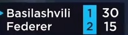

### Papers and Approach:
    * https://arxiv.org/pdf/1801.01430.pdf
    *
    * Temporarily segmenting out the rallies. (DONE)
    * Scorecard & Score Extraction (OCR Problem)
    * OCR used: Google Tesseract (pytesseract)
    *

### Installation Guideline
    * tesseract installation properly:
      * https://medium.com/@ahmedbr/how-to-implement-pytesseract-properly-d6e2c2bc6dda
## Current Pipeline:
   * Deep Learning Based
        * Pass in TextFuseNet:
    2) OpenCV OCR + Tesseract Engine: https://www.pyimagesearch.com/2018/09/17/opencv-ocr-and-text-recognition-with-tesseract/

    * Pypi: https://github.com/madmaze/pytesseract
    * https://pypi.org/project/pytextractor/33

    * Wild-OCR: https://github.com/oezguensi/wild-OCR
    * Rally Segmentation: Court detection (DONE already)
    * Tennis Video --> Court (Yes or No)
    * Scoreboard Extraction: Optical Flow Constant Objects
    * TODO: Read: https://cdn.iiit.ac.in/cdn/cvit.iiit.ac.in/images/Thesis/MS/Anurag_Ghosh/Anurag_MS_Thesis.pdf
    * Optical Flow: https://developer.nvidia.com/blog/opencv-optical-flow-algorithms-with-nvidia-turing-gpus/
    * Tested Lucas Kanade Flow method.
    * Now testing the other pyramid approaches.
    * Mention optimisation with Nvidia Cuda implementation: https://developer.nvidia.com/blog/opencv-optical-flow-algorithms-with-nvidia-turing-gpus/

## Optimisation and Inference:
  * Video Scene Classification:
    The video sometimes contain commercials and highlights which
    need to be removed. classification as playing vs non-playing scene. (Binary Classification Problem). Several approaches will be mentionned below:
    * 1. Tennis Court Detection -- Classical Computer Vision.
          Hough Lines, Edge Detectors and Gaussian Smoothing.
          Elimination of Points via the Homography Matrix. (To find the tennis plane)
          
          

          Adv: Classical Computer Vision and can run in real time. 
          Disadv: Camera moves with the scene it can lead to fitting error. (plane rotation, etc..) --> Can be further solved by running a camera estimation
          parameter using Fundamental Matrix/Essential Matrix with Bundle Adjustment
          and warping the view.
    * 2.  I have viewed a bit of tennis videos, its pretty humanly clear to classify the   videos. Since the tennis court is a plane occupying most of the frame when focused on game rather than the commercial:
    We can use 3D Vectors or Feature Vectors: (example SIFT or Histogram of Oriented Gradients) learned. Use a banal classifier like SVM or even simple NN can classify
    the scenes. This could further be used to perform automatic annotation of data.

    * 3. Finally, one can use Deep Learning: Since the problem is more of a contrastive problem. Good Example vs Bad Example specifically. Siamese neural network
    would be a really good fit here.
    Disadv: its more work to manually build the positive pair vs negative pair for the anchor.
    Adv: * Really robust against noisy data. (Contrastive and Triplet Loss)
         * The feature extractor can be updated from VGG to ResNet to Inception NN if needed.

  * Scorecard Extraction
    
      * Optical Flow Part:
        Referred from Nvidia Claim: https://developer.nvidia.com/opticalflow-sdk
          * Up to 150 fps at 4K resolution.
          * at 1/4 pixel resolution. (150*4)x Improvement Factor.

      * Implementation of Lukas Kanade
        * CURRENT & LIMITATIONS :
        * IMPROVEMENT :
          * Why and how it is really good.
          * Video Screenshot:
            
            
            
            
            
            
            

    * Digit & Character Recognition Part
      * Some screenshots here:
        * 
        * 

      * CURRENT:
        * The player name is finite. So it is possible to build a dictionary
          to further refine results. This allows to eliminate errors from the
          Tesseract V4. LSTM based Google OCR Engine.
      * IMPROVEMENT:
        * Given that the Tesseract Engine is LSTM based and has been trained onto
          thousands of texts with different handwriting, fonts, lighting conditions(contrast) and so on. It captures a lot of variance which are
          not needed here: for instance: handwriting, contrast and lighting.
          Instead one can custom train the Tesseract engine for this particular use-case
        * Other options:
          * Google Cloud Vision API
          * Microsoft Computer Vision API
          * miscellaneous cloud providers.
      * Separate the run for digit and character part.
      We can use data mining to detect  the true names from a dictionary
    * Even if we don't have perfect scoreboard detection, the list of
      players in Tennis is finite. So build a dictionary and search if the
      detected player game is inside the dictionary. (Sanity Check)

## My Development Philosophy:
   * Fast Code write-up always done on: https://replit.com/~?onboarding=1
   * Ubuntu 18.04, Atom, Sublime Text,
   * Github, possibly for production Docker, Github integrated workflows CI/CD
   * Hoping github releases Codespace soon.
## TODOs
   * Elaborate on the video frame classification (rally extraction), video stabilisation.
   * Speak in details about your prowess of detectors.
   * Implement the Dense Lucas Kanade for better tracking and optical flow vectors

## Reference
   * https://github.com/gchlebus/tennis-court-detection
   * https://github.com/vishaltiwari/bmvc-tennis-analytics
   *

## Installation
   * pip install: pip install opencv-contrib-python
   * Install the requirements.txt --> pip install -r requirements.txt
   *
